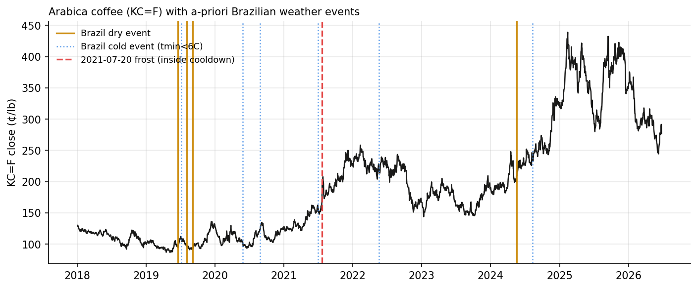

# Do growing-region weather anomalies predict coffee futures returns?

**Scott Dong · ascent-agri working paper · July 2026**
*Code, data pipeline, and reproduction commands: [github.com/ScottDongKhang/ascent-agri](https://github.com/ScottDongKhang/ascent-agri)*

## Abstract

Coffee is the textbook weather-driven commodity, yet most retail commentary
asserts the weather–price link rather than measuring it. I test whether
daily weather anomalies at two benchmark growing regions — Buon Ma Thuot,
Vietnam (robusta) and Varginha, Sul de Minas, Brazil (arabica) — contain
predictive information for coffee futures returns, using an event-study
design with all parameters fixed a priori, a Monte-Carlo permutation test
for inference, and a built-in placebo structure (each region's weather is
tested against the *other* region's crop). Brazilian dry-spell events are
followed by arabica returns of +5.1 percentage points over 5 trading days in
excess of baseline (n=4, permutation p=0.041, uncorrected) and +12.2pp over
63 days (p=0.14, hit rate 4/4); the cross-placebo (Vietnamese dryness →
arabica) is null at every horizon, as designed. Daily-frequency lead–lag
correlations are indistinguishable from zero everywhere, suggesting any
weather information is either priced continuously or concentrated in rare
discrete events. The primary hypothesis — Vietnamese dryness → robusta —
is currently *untestable at the event level*: zero qualifying dry events
occur within the 17 months of hand-built robusta price history, which
quantifies precisely why extending that series is the project's critical
path. I also document a cautionary methodological result: the canonical
July 20, 2021 Brazilian frost (+33.8% in 5 trading days) was absorbed by
the cooldown window of a benign cold snap three weeks earlier, so the
a-priori event rule *missed the single largest weather event in the sample*
— a concrete illustration of event-definition risk. With n≤6 events per
test, none of these estimates survives correction for the nine hypotheses
tested; this paper is a design and a data commitment, not a discovery claim.

## 1. Background and mechanism

Vietnam produces roughly a third of the world's coffee and the large
majority of its robusta, concentrated in the Central Highlands (Dak Lak and
neighboring provinces). Brazil dominates arabica, with Sul de Minas its
largest belt. Two mechanisms link local weather to world prices:

1. **Supply shocks.** Persistent dryness during critical growth phases cuts
   yields; in Brazil, winter frost events (June–August) can destroy both
   the current harvest and the following season's, because damaged trees
   take years to recover. The July 1975 and July 2021 frosts each produced
   historic price spikes.
2. **Currency pass-through.** Brazilian growers sell in dollars and spend
   in reais; a weakening real raises local-currency revenue per bag and
   adds selling pressure. The BRL/USD rate is therefore a standing
   confounder for any Brazil-side analysis, and is tracked (though not yet
   conditioned on) throughout this project.

The question here is narrower than "does weather matter" — obviously it
does, mechanically, through supply. The question is whether *publicly
available daily station-level anomalies* contain information that shows up
in *subsequent* futures returns, i.e., whether the market leaves anything
on the table after a weather signal becomes observable.

## 2. Data

| Series | Source | Span used |
|---|---|---|
| Arabica futures (KC=F, daily close) | Yahoo Finance via yfinance | 2018-01-02 → 2026-06-25 |
| Robusta continuous (hand-built, ratio roll-adjusted) | Barchart per-contract CSVs (currently 1 contract, RMU26) | 2025-01-29 → 2026-06-24 |
| Buon Ma Thuot weather (12.68 N, 108.04 E) | Open-Meteo historical archive (daily) | 2017-01-01 → 2026-06-26 |
| Varginha weather (−21.55, −45.43); rain, mean & min temperature | Open-Meteo historical archive (daily) | 2017-01-01 → 2026-06-26 |

Two disclosures. First, arabica serves as the long-history benchmark
because no compliant daily robusta series with multi-year history is freely
available; the robusta series in this repository is being assembled from
individual expired contracts and currently spans ~17 months. Second, each
region is represented by a single grid cell; growing belts are large, and
a production-weighted multi-station composite is an obvious refinement.

## 3. Methods

All parameters were fixed before outcomes were inspected.

**Anomalies (causal).** The 30-day rolling rainfall mean is z-scored
against the same location's trailing 365 days, shifted one day so the
baseline uses strictly past data. No future information enters any signal.

**Events.**
- *Dry event*: first day the 30-day rainfall anomaly closes below −1.25σ
  after ≥30 calendar days above it (the cooldown collapses one drought into
  one event).
- *Cold event* (Brazil only): first day with 2-meter minimum temperature
  below 6.0°C after ≥30 days without one. Reanalysis-scale 2m temperatures
  over this grid cell never reach 0°C, so 6°C serves as the standard
  ground-frost-risk proxy.

**Outcome.** Cumulative close-to-close returns over the next 5, 21, and 63
trading days, with each calendar-day event mapped to the first trading day
at or after it.

**Inference.** The mean forward return across events is compared with the
distribution of means across 2,000 same-size random draws of trading days
(Monte-Carlo permutation test); reported p-values are two-sided and
**uncorrected**. Nine event-study hypotheses are examined (3 signals × 3
horizons on the arabica target), so a Bonferroni-minded reader should
require p < 0.006 — none of the results clears that bar. Lead–lag analysis
uses the daily Spearman correlation between the anomaly and forward
returns, with a 95% moving-block bootstrap CI (block = 21 days) to respect
serial dependence.

**Control structure.** Each weather signal is also run against the *other*
region's crop. Vietnamese dryness has no supply channel to arabica (and
vice versa, to first order), so those cells function as placebos: if the
pipeline manufactures effects, it should manufacture them there too.

## 4. Results

### 4.1 Event studies (arabica target, 2018–2026)

| Signal | n | 5d excess (p) | 21d excess (p) | 63d excess (p) | 63d hit rate |
|---|---|---|---|---|---|
| **Brazil dry** | 4 | **+5.1pp (0.041)** | +5.6pp (0.25) | **+12.2pp (0.14)** | 4/4 |
| Brazil cold (tmin<6°C) | 6 | +1.9pp (0.36) | −0.8pp (0.84) | +2.8pp (0.67) | 4/6 |
| Vietnam dry (placebo) | 3 | +0.8pp (0.80) | −0.6pp (0.92) | −3.9pp (0.68) | 2/3 |

*Baseline means over the full sample: +0.3pp (5d), +1.3pp (21d), +3.9pp
(63d). Event dates — Brazil dry: 2019-06-17, 2019-08-03, 2019-09-04,
2024-05-18. Brazil cold: 2019-07-07, 2020-05-27, 2020-08-26, 2021-07-01,
2022-05-20, 2024-08-11. Vietnam dry: 2018-04-19, 2022-12-27, 2023-02-07.*



The pattern is coherent with the supply mechanism: Brazilian dry events
precede above-baseline arabica returns at every horizon, with the 5-day
window nominally significant and all four 63-day windows positive. The
placebo behaves exactly as a placebo should. But n=4 is n=4: a single
different event would materially move every number, and the nominal p=0.041
does not survive multiple-comparisons correction. The honest summary is
*suggestive, correctly signed, underpowered*.

### 4.2 The frost that the rules missed

The July 20, 2021 Sul de Minas frost is the canonical modern weather shock:
from the July 19 close, arabica rose **+6.7% the next day and +33.8% over
five trading days**. The a-priori event list does not contain it. A benign
cold snap on July 1, 2021 triggered the tmin threshold first, and the
30-day cooldown then swallowed July 20. This is reported as a result, not
fixed retroactively: redefining events after seeing outcomes is precisely
the practice the fixed-parameter design exists to prevent. The lesson —
threshold-plus-cooldown event definitions can absorb the very extremes they
target into their refractory period — generalizes to any event-study
design, and severity-weighted event definitions are the natural pre-registered
refinement for the next data release.

### 4.3 Lead–lag (daily granularity)

| Anomaly ~ target | 21d Spearman | 95% block-bootstrap CI |
|---|---|---|
| Vietnam rain ~ arabica | +0.10 | [−0.04, +0.23] |
| Brazil rain ~ arabica | +0.01 | [−0.15, +0.15] |
| Vietnam rain ~ robusta | −0.03 | [−0.42, +0.31] |
| Brazil rain ~ robusta | −0.17 | [−0.51, +0.30] |

Every interval contains zero. At daily granularity, smoothed rainfall
anomalies carry no detectable monotone signal for forward returns — either
the market absorbs gradual weather information continuously (the
efficient-market null), or the signal lives only in rare discrete extremes,
which is what the event-study panel weakly suggests.

### 4.4 The primary hypothesis is data-limited

Zero Vietnamese dry events fall within the robusta price window
(2025-01 → 2026-06): the Central Highlands were near or above their rainfall
norm for that entire span. The project's central question — does Highlands
dryness predict *robusta* returns — therefore cannot yet be tested at the
event level. This is the quantified case for the repository's data
roadmap: backfilling robusta contract history to ~2023 would bring the
2024 drought (which coincided with robusta's record run) into sample.

## 5. Limitations

Small event counts; single station per region; uncorrected multiple
comparisons (disclosed); no conditioning on BRL/USD or broader commodity
beta; arabica benchmark standing in for the robusta deliverable;
close-to-close returns ignore intraday reaction; Open-Meteo reanalysis
temperatures understate ground-level frost severity.

## 6. Conclusion

With a-priori definitions and honest inference, publicly available daily
weather data shows correctly-signed but statistically inconclusive
predictive content for coffee futures at event granularity, and none at
daily granularity. The infrastructure contribution — a causal,
placebo-controlled, permutation-tested pipeline that anyone can rerun in
one command — is the durable result; the estimates will sharpen mechanically
as the robusta series and event counts grow.

## Reproduction

```bash
git clone https://github.com/ScottDongKhang/ascent-agri && cd ascent-agri
python3 -m venv .venv && source .venv/bin/activate
pip install -r requirements.txt
python -m ascentagri.research.weather_study   # fetches weather caches on first run
# full output: outputs/research/weather_study.json
```

*Data credits: Yahoo Finance (KC=F), Open-Meteo historical weather archive,
Barchart (manually downloaded per-contract CSVs, personal use). This is an
educational research artifact, not investment advice.*
